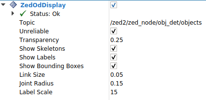
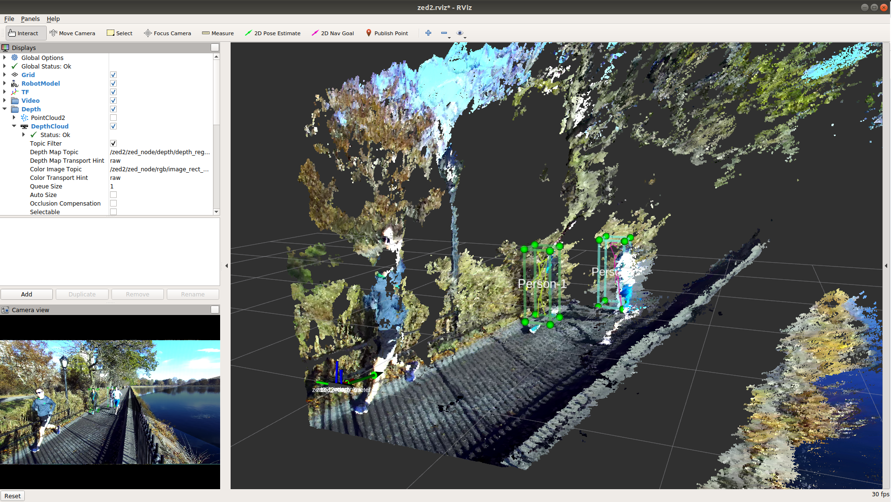
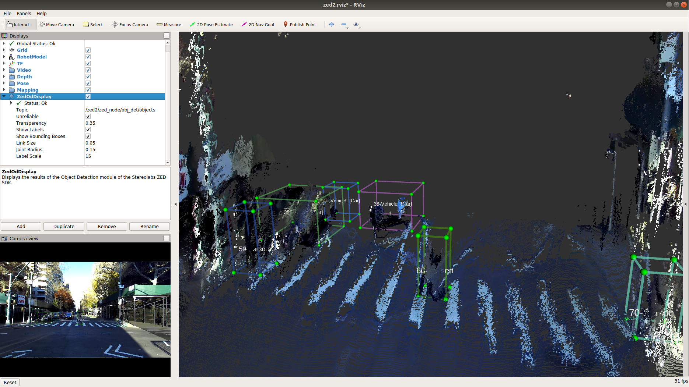

# Stereolabs ZED Camera - ROS Object Detection Rviz Plugin

This package lets you visualize in the [ROS RViz application](http://wiki.ros.org/rviz) all the
information provided by the Object Detection module of the ZED SDK used together with a ZED2 camera.

**Note:** The main package [zed-ros-wrapper](https://github.com/stereolabs/zed-ros-wrapper)
is required to correctly execute the ROS node to acquire data from a Stereolabs 3D camera.

## Getting started

   - First, be sure to have installed the main ROS package to integrate the ZED cameras in the ROS framework: [zed-ros-wrapper](https://github.com/stereolabs/zed-ros-wrapper/#build-the-program)
   - [Install](#Installation) the package
   - Read the online documentation for [More information](https://www.stereolabs.com/docs/ros/)

### Prerequisites

   - Ubuntu 18.04 or newer (Ubuntu 18 recommended)
   - [ZED SDK](https://www.stereolabs.com/developers/release/latest/) v3.4 or later
   - [ROS Melodic](http://wiki.ros.org/melodic/Installation/Ubuntu)

### Installation

The *zed_display_rviz* is a catking package. 

Install the [zed-ros-wrapper](https://www.stereolabs.com/documentation/guides/using-zed-with-ros/introduction.html) package
following the [installation guide](https://github.com/stereolabs/zed-ros-wrapper#build-the-program)

Install the [zed-ros-examples](https://github.com/stereolabs/zed-ros-examples) package following the [installation guide](https://github.com/stereolabs/zed-ros-examples#build-the-program)

### Execution

Available only if you own a ZED 2 camera:

    $ roslaunch zed_display_rviz display_zed2.launch

[Detailed information](https://www.stereolabs.com/docs/ros/object-detection/)
