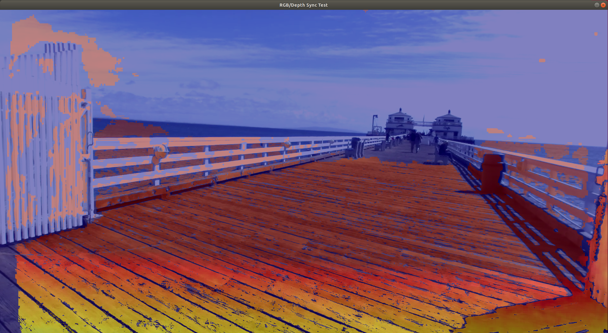

# Stereolabs ZED Camera - ZED Sync Test

This is a test package to verify the correct syncronization of RGB and Depth topics using `message_filters`.

## Usage

Open a console and enter the CLI command
    
    $ roslaunch zed_sync_test zed_sync_nodelet.launch
    
**Note**: before launching modify the parameter [`camera_model`](https://github.com/stereolabs/zed-ros-examples/blob/master/tests/zed_sync_test/launch/zed_sync_nodelet.launch#L22) in the file [`zed_sync_nodelet.launch`](https://github.com/stereolabs/zed-ros-examples/blob/master/tests/zed_sync_test/launch/zed_sync_nodelet.launch) to match the correct model of the Stereolabs camera that you are using.

When the test node is running an `image_view` window is displayed showing the test image. 

The test image is composed by the RGB image as background and the depth image (with remapped colors) as overlay.

To test the synchronization simply move the camera and verify that the overlay depth map follows the movements of the background RGB image without delays.

## Options and parameters
It is possible to save the results frame-by-frame setting the parameter [`save_frames`](https://github.com/stereolabs/zed-ros-examples/blob/master/tests/zed_sync_test/launch/zed_sync_nodelet.launch#L81) to `true` and setting [save path](https://github.com/stereolabs/zed-ros-examples/blob/master/tests/zed_sync_test/launch/zed_sync_nodelet.launch#L82).

